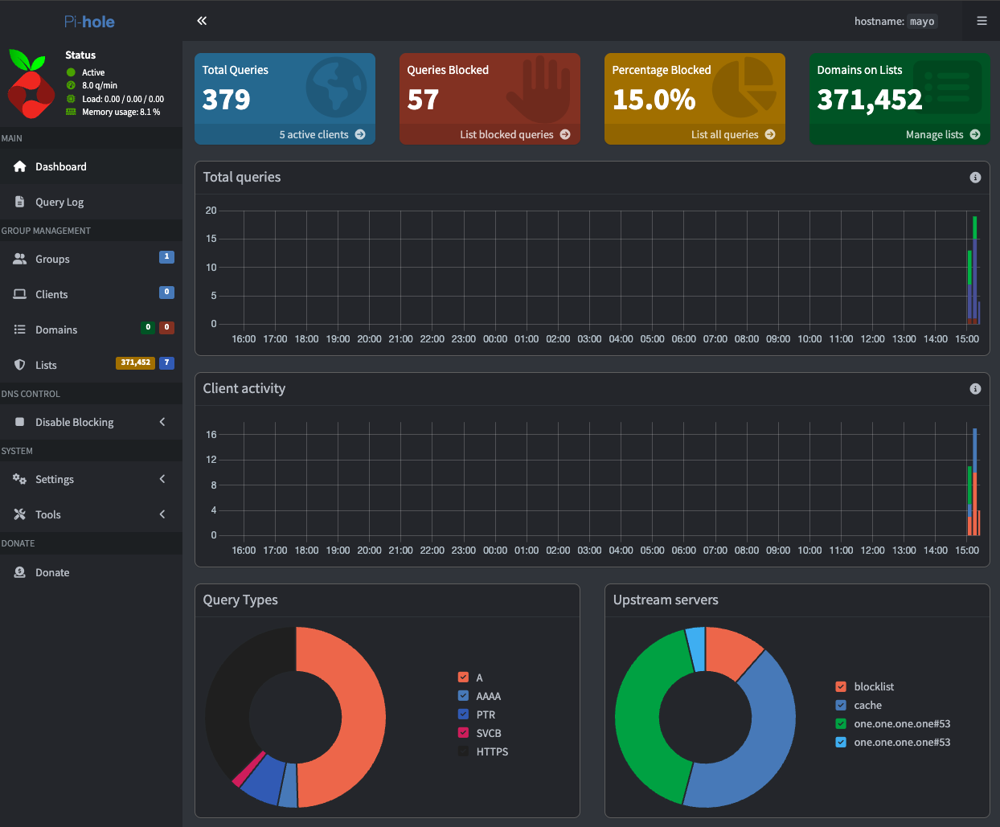
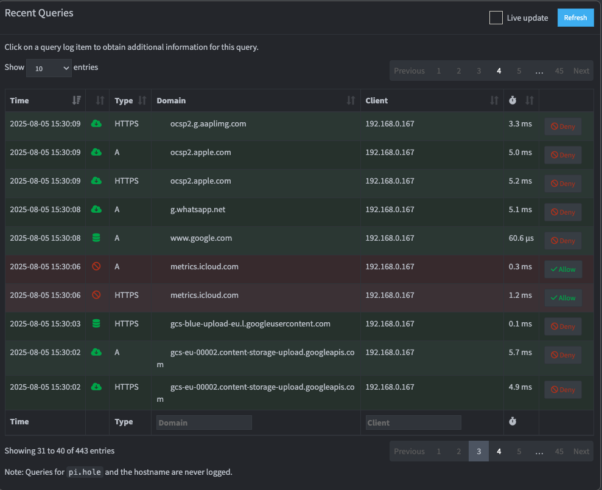
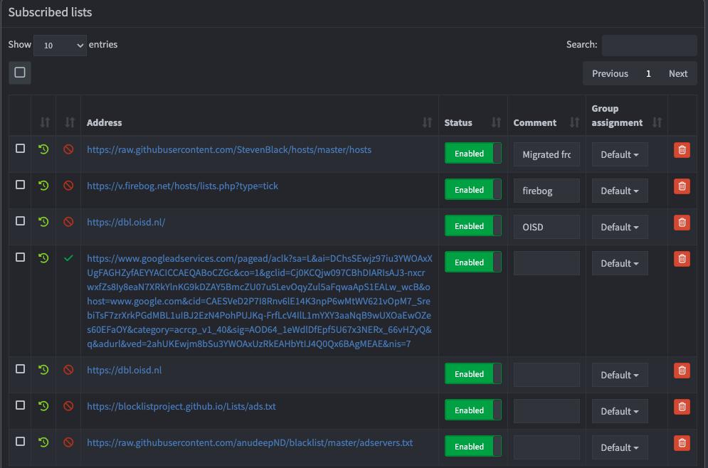
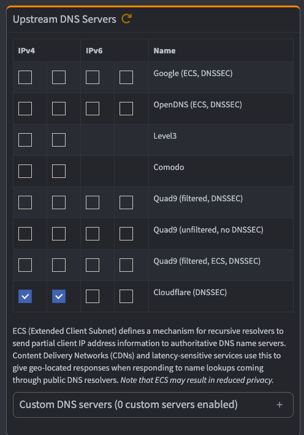
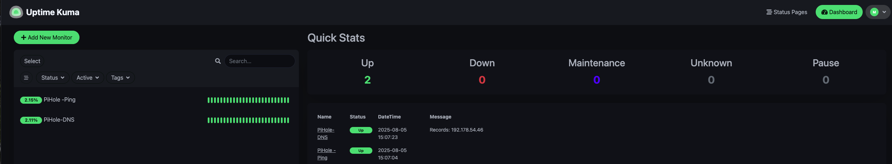
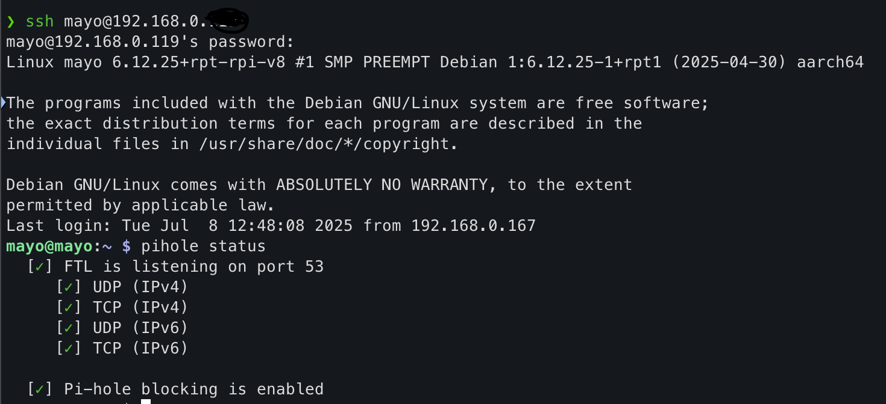

🍍 Pi-hole Self-Hosted DNS Ad Blocker

Welcome to my Pi-hole project! This repository documents how I set up, configured, and hardened my Pi-hole on a Raspberry Pi 4 to serve as a network-wide ad blocker and part of my personal homelab.

---

🔧 Project Overview
- Purpose: Block ads, trackers, and malicious domains at the DNS level across my entire home network.
- Platform: Raspberry Pi
- DNS Resolver: Pi-hole
- Additional Tools:
  - ✅ Uptime Kuma (monitor Pi-hole health)
  - ✅ Cloudflare DNS for upstream resolution
  - ✅ Tailscale (remote access to dashboard)

---

🧱 Setup Summary
| Component   | Configuration |
|-------------|----------------|
| Device      | Raspberry Pi (Model ___) |
| IP Address  | Static: `192.168.X.XXX` |
| OS          | Raspberry Pi OS Lite |
| DNS         | Pi-hole (port 53) |
| Remote      | Tailscale VPN |
| Monitoring  | Uptime Kuma |
| Storage     | SD card + optional external drive |

---

📦 Features
- ✅ DNS-level ad and tracker blocking
- ✅ Custom blocklists (Firebog tick list)
- ✅ HTTPS/SSL enforced via Cloudflare DNS
- ✅ Remote monitoring with Uptime Kuma
- ✅ CNAME deep inspection enabled
- ✅ Tailscale access from phone outside LAN

---

📸 Screenshots

Here’s a visual look at my Pi-hole ad blocker setup:

Pi-Hole Dashboard Overview

Query Log

Blocklists

DNS Servers

Uptime Kuma Integration

SSH into Rasberry Pi

🧠 Tips & Notes
-Use DHCP reservation to keep Pi's IP static.
-Make sure your router’s DNS is set to Pi-hole's IP.
-Enable CNAME_DEEP_INSPECT=true in /etc/pihole/pihole-FTL.conf.
-Use Tailscale to access Pi-hole remotely from mobile.
